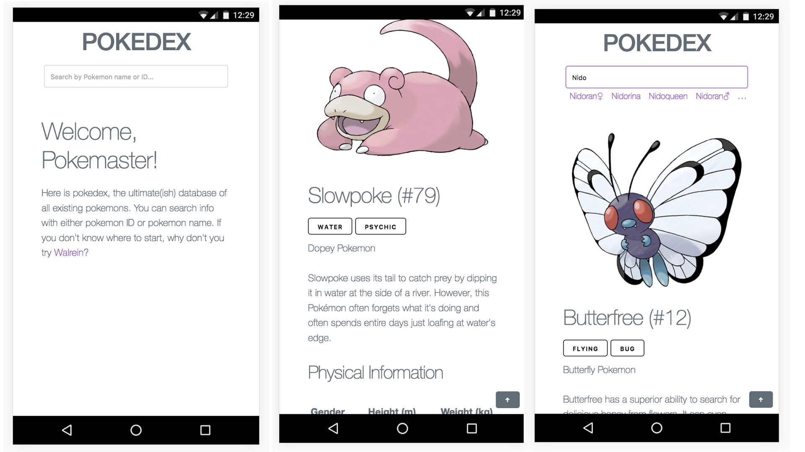

# Pokedex 포켓몬 도감

포켓몬 도감입니다. 사용한 주요 기술은 다음과 같습니다.

- 백엔드 : Flask (Python 3.5+) + [requests](http://docs.python-requests.org/en/master/)

- 프론트엔드 : ES6 + [Stylus](http://stylus-lang.com/) + [babel](https://babeljs.io/) + [Webpack](https://webpack.github.io/) + [milligram](https://milligram.github.io/) + [fetch](https://developer.mozilla.org/en-US/docs/Web/API/Fetch_API)

- 디비 : 빠른 개발을 위한 SQLite3

영어 포켓몬 데이터는 [공식 포켓몬 도감](http://www.pokemon.com/us/pokedex/), 국가별 포켓몬 이름은 [포켓몬 위키](http://ko.pokemon.wikia.com/wiki/%EA%B5%AD%EA%B0%80%EB%B3%84_%ED%8F%AC%EC%BC%93%EB%AA%AC_%EC%9D%B4%EB%A6%84_%EB%AA%A9%EB%A1%9D)에서 가져왔습니다.

## 기능

- 영어 지원 - 후에 언어별로 확장 가능하게 설계
- 번호나 이름으로 포켓몬 검색
- 처음 검색하는 포켓몬일시 크롤링 후 DB에 저장
- 검색 과정에서 이름 자동완성
- 진화 사슬 정보 제공
- 모바일/웹에 알맞게 대응하는 반응형 디자인
- ~~이미 검색해본 포켓몬일시 DB에 있는 정보 불러옴~~

기존에 설계한 디비가 부실해 진화 정보를 추가하는 과정에서 기존에 정의한 데이터베이스 스키마 및 흐름과 어긋나는 부분이 있어 사실상 현재 디비에는 저장만 하고 (설령 진화 이외의 모든 정보가 디비에 있어도) 매번 크롤링을 해오고 있습니다. 아래 **문제점과 개선 방안**에서 좀 더 자세히 설명하겠습니다.

## 데이터베이스 스키마

다른 언어군 간에 중복되는 정보가 거의 전무하므로 언어 정보만 담고 있는 Locale 테이블과 실제 엔트리가 들어있는 Pokemon 테이블을 분리해 1:n relation으로 관리했습니다. 위에서 언급했지만 뒤늦게 추가한 진화 정보를 현재 데이터베이스에 저장하지 못하고 있습니다.

### Pokemon

- 포켓몬 번호 PK
- 이미지 URL
- 성별
- 타입
- 키
- 몸무게

### PokemonLocale

- 포켓몬 번호 PK
- 로케일 PK
- 포켓몬 이름
- 설명
- 분류
- Pokemon 아이디 FK

## 다국어 지원

시간 관계상 서비스의 영어 버전만을 구현했지만, 이후 다국어 지원을 고려한 지점이 몇 있습니다.

- 데이터베이스 Pokemon - PokemonLocale 구분
- parse_pokemon_en 등 크롤링 해온 데이터 언어별(소스의 구조별)로 다르게 파싱해야 할 때 손쉽게 확장 가능하도록 설계

만약 다국어 환경을 지원하기 위해선 다음과 같은 조치들이 필요합니다.

- 서비스 최초 접속시 사용자에게 언어 설정을 물은 뒤 결과를 flask session에 저장.
- 현재는 LocaleType.EN 으로 하드코딩 되어 있는 언어 정보를 모두 세션에 있는 정보에 기반하여 사용

- templates 폴더 밑에 지원 언어별 서브디렉토리 및 템플릿 생성, render_template 에서 적절한 템플릿 렌더
- Pokemon 모델 내의 필드들의 각 언어별 매핑 (예를 들어, 타입에서의 Bug -> 벌레(한국어), Bug (영어) 등) 설정

## 문제점 및 개선 방안

### 데이터베이스 정보 미활용

지금 코드 (pokedex/views.py) 에서는 유저가 찾는 정보가 이미 데이터베이스에 있는지 확인하고, 처음 찾는 정보의 경우 데이터베이스에 저장하는 로직 등은 모두 구현되어 있습니다. 설계 시작 당시 저의 계획은 맨 처음 검색하는 경우만 크롤링을 해오고 그 이후는 데이터베이스에서 정보를 가져오는 것이였습니다. 포켓몬에 대한 기본적인 정보만 가져오는 상황에서는 잘 작동하지만, 이후 (포켓몬의 핵심 정보 중 하나인) 여러 포켓몬이 연관되어 있는 진화 정보를 추가하면서 사실상 그런 방식을 취하기가 불가능해졌습니다. 해결책으로는 크게 두 가지를 생각 해 보았습니다.

1. 별도의 Evolution 테이블을 만들어 (진화 이전의 포켓몬 ID, 진화 이전의 포켓몬 이름, 진화 이후의 포켓몬 ID, 진화 이후의 포켓몬 이름)의 형식으로 레코드를 관리할 수 있습니다. 이 때 크롤링 해 온 한 페이지에 들어있는 정보만 사용할 수 있으므로 Pokemon 테이블의 FK 대신 포켓몬 ID 만을 저장하게 합니다. 이후 특정 포켓몬에 대한 맨 처음 쿼리는 Pokemon, PokemonLocale, Evolution 테이블에 각각 (중복되지 않도록) 레코드를 넣어주고, 이후 Pokemon 테이블에 존재하는 포켓몬에 대한 쿼리가 들어왔을 시 Evolution 테이블에서 자료를 가져오는 식으로 사용자 요청을 처리할 수 있습니다. 이렇게 할 시 (제가 원래 설계했던대로) 맨 처음 한 번만 크롤링을 해 오면 되어 효과적입니다.
2. 사용자 트래픽이 그리 많지 않고, 서버의 네트워크 환경이 매우 좋다는 가정 하에 데이터베이스를 아예 사용하지 않고 크롤링만으로 돌아가는 서비스를 구현할 수도 있을 것 같습니다. 1번 방식에 비해 퍼포먼스는 상대적으로 많이 손해를 보겠지만 상대적으로 구현이 쉬워집니다. 또한 스키마에 구애받지 않고 언어별로 특화된 자료들(예를 들어 한국어의 경우 한국 포켓몬 커뮤니티 검색 결과 등) 을 그 때 그 때보내줄 수 있다는 장점이 있습니다.

### 자바스크립트 코드

처음 프로젝트를 시작할 때, 상대적으로 간단한 프로젝트라 생각하여 굳이 SPA로 만들 필요가 없다고 생각했습니다. 실제로 꽤 간단하긴 했지만 막바지에 나름대로 구조가 복잡해지고 자동 완성 기능을 바닐라 JS로 구현하면서 애초에 리액트, 리덕스 정도를 사용해 SPA로 구현하는게 더 깔끔하고 (초기 보일러플레이트를 감안해도) 간단하게 구현할 수 있었을 수 있겠다고 느꼈습니다.

### 브라우저 서포트

시간 제한이 있는 프로젝트에서 짧은 시간 내에 괜찮은 룩앤필을 얻기 위해 milligram 이라는 Flexbox 에 기반한 프론트엔드 프레임워크를 사용했습니다. 그 외에 일부 직접 Flexbox를 사용한 부분도 있습니다. (fetch의 경우 깃헙의 폴리필을 사용했습니다) 때문에 IE 지원이 부실합니다. 만약 낡은 버전의 익스플로러 지원들이 꼭 필요한 서비스일 경우 해당 부분들을 Flexbox 대신 다른 기술을 이용해 구현해야 할 것입니다.
